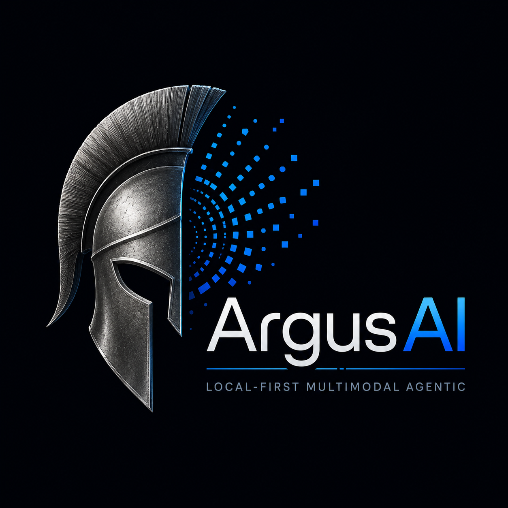
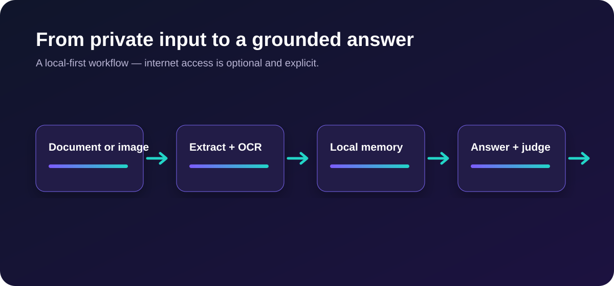
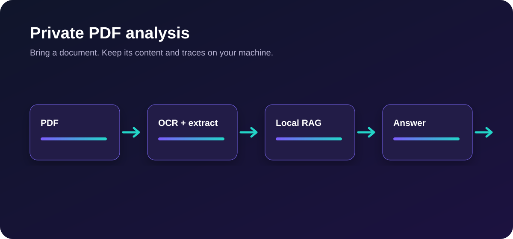
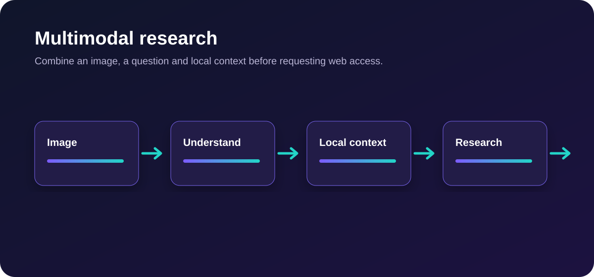
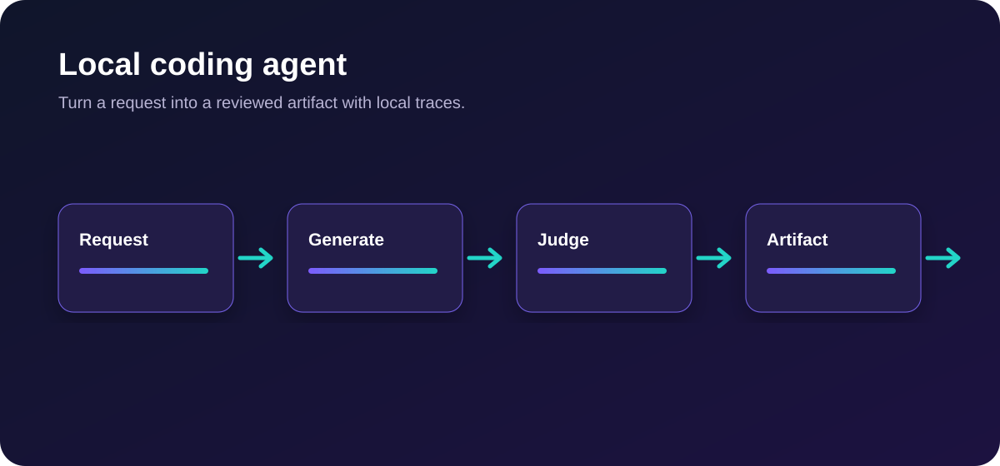
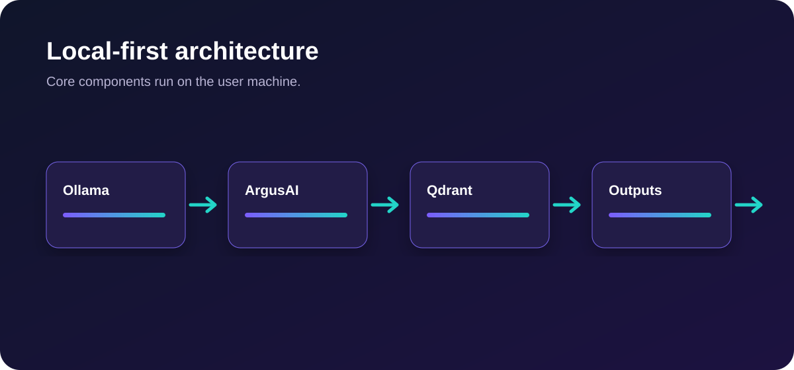

<p align="center">
  
</p>

<h1 align="center">ArgusAI</h1>

<p align="center"><strong>Local AI agent that sees, reads, searches, remembers and reasons — on your machine.</strong></p>

<p align="center">
  
  
  
  <a href="LICENSE.md"></a>
</p>

<p align="center">
  <a href="#quick-start">Quick start</a> ·
  <a href="#what-it-does">What it does</a> ·
  <a href="#examples">Examples</a> ·
  <a href="#installation-profiles">Installation profiles</a>
</p>



ArgusAI is a local-first multimodal AI assistant for developers, researchers and privacy-conscious teams. Give it a document, an image or a question: it extracts evidence, uses local memory, optionally searches the web with your approval, and checks its own answer before responding.

**Your models. Your data. Your machine.** No cloud AI provider is required for the default stack.

## What it does

| You give ArgusAI | It does locally |
| --- | --- |
| A confidential PDF | Extracts text, runs OCR when needed, indexes it and answers with context. |
| An image or scan | Interprets the image, extracts visible text and explains what it found. |
| A research question | Uses its local memory first; web access remains disabled until you enable it. |
| A coding task | Produces an artifact locally and records an execution trace. |

<p align="center"> </p>

### Built for controlled work

- **Private by default** — Ollama, Qdrant, OCR and execution traces stay on your machine.
- **Multimodal** — documents, PDFs, images and normal chat in one CLI workflow.
- **Evidence-aware** — local RAG memory, OCR and a judge pass help produce more grounded answers.
- **Web access is explicit** — internet tools are disabled by default and request confirmation.
- **Developer-friendly** — Docker, CLI, tests and JSONL traces are included.

## Quick start

The **Lite** profile is the shortest way to try ArgusAI. It uses one multimodal model for routing, reasoning, judging and coding, plus one embedding model for memory.

```bash
git clone https://github.com/MoulayeSDh/ArgusAI.git
cd ArgusAI
cp .env.lite.example .env
ollama pull qwen3-vl:8b
ollama pull qwen3-embedding:latest
docker compose run --rm argusai doctor
docker compose run --rm argusai
```

On Windows PowerShell, replace `cp` with:

```powershell
Copy-Item .env.lite.example .env
```

Ollama must be running on the host before the Docker commands. See [Installation profiles](#installation-profiles) for the full multi-model setup.

## A complete workflow



```text
Drop a confidential document
        ↓
Extract text + OCR when necessary
        ↓
Store searchable context in local memory
        ↓
Ask a question or request an artifact
        ↓
Validate the response with a local judge pass
        ↓
Keep traces on your machine
```

## Examples

Three short walkthroughs show the core use cases without requiring client data:

- [Private PDF analysis](examples/private_pdf_analysis/README.md)
- [Multimodal research](examples/multimodal_research/README.md)
- [Local coding agent](examples/local_coding_agent/README.md)

## Installation profiles

### Lite — two local models

Best for a first demonstration or a laptop with limited resources.

```bash
cp .env.lite.example .env
ollama pull qwen3-vl:8b
ollama pull qwen3-embedding:latest
docker compose run --rm argusai doctor
docker compose run --rm argusai
```

The Lite profile deliberately assigns `qwen3-vl:8b` to the conversational roles and keeps `qwen3-embedding:latest` for local memory.

### Full — specialized local models

Best for the complete routing, reasoning, judge and coding configuration.

```bash
cp .env.full.example .env
ollama pull qwen3-vl:8b
ollama pull deepseek-r1:8b
ollama pull qwen3.5:9b
ollama pull qwen2.5-coder:7b
ollama pull qwen3-embedding:latest
docker compose run --rm argusai doctor
docker compose run --rm argusai
```

### Direct Python installation

```bash
python -m venv .venv
# macOS / Linux
source .venv/bin/activate
# Windows PowerShell: .venv\Scripts\Activate.ps1
pip install -r requirements.txt
pip install -e .
argusai doctor
argusai
```

## CLI commands

```text
/image <path>   Analyze an image
/doc <path>     Analyze a document
/web on|off     Arm or disable web access
/history        Show recent conversation history
/status         Show runtime status
/clear          Clear the terminal screen
/help           Show help
exit            Quit ArgusAI
```

## Local-first architecture



```text
Ollama     → local LLM inference
Qdrant     → local vector memory
Tesseract  → OCR for scans and documents
CLI        → local interaction
outputs/   → local logs, traces and generated artifacts
```

Internet access is disabled by default. When enabled with `/web on`, ArgusAI still asks for confirmation before using a search or scraping tool.

## Configuration

The Docker Compose profile reads model configuration from `.env`. Start from either `.env.lite.example` or `.env.full.example`; `.env` is intentionally ignored by Git.

The important variables are:

```dotenv
ARGUSAI_ROUTER_MODEL=qwen3-vl:8b
ARGUSAI_REASONING_MODEL=qwen3-vl:8b
ARGUSAI_JUDGE_MODEL=qwen3-vl:8b
ARGUSAI_CODER_MODEL=qwen3-vl:8b
ARGUSAI_EMBEDDING_MODEL=qwen3-embedding:latest
```

## Development and tests

```bash
pip install -e .
pip install pytest
pytest -q
```

Runtime files are written under `outputs/` and are not committed.

## Project status

ArgusAI is an early beta (`v0.1.0-beta`). The focus is reliable local execution, transparent workflows and modular extensibility.

## License

This project is source-available under the [PolyForm Noncommercial License 1.0.0](LICENSE.md). Commercial use requires explicit written permission from the author.
